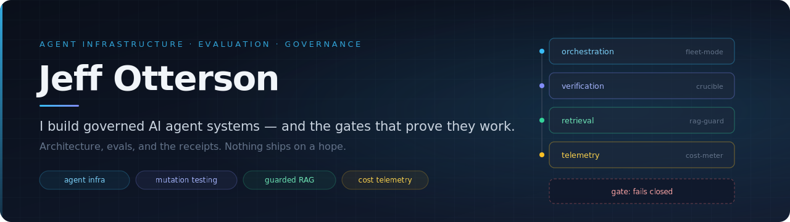
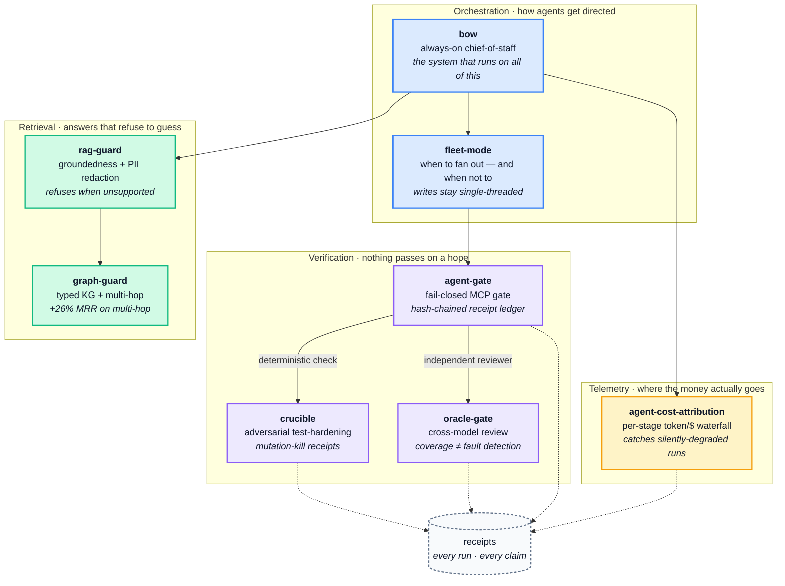

  

  
  
  
  
  

---

I architect and operate production AI agent systems. I own the design, the evaluations, and the
gates — then I direct fleets of Claude subagents to do the typing. Nothing ships until a
deterministic check and an independent reviewer both pass.

I'd rather show you the failure I caught than the demo I polished.

## The stack

These aren't scattered side projects. They're layers of one system: agents that do work, gates that
refuse to let bad work through, and receipts that prove which of the two happened.

## Featured

### [crucible](https://github.com/Jott2121/crucible) — *your AI wrote the tests. Who tested the tests?*

Coverage measures what **ran**, not what would be **caught**. On a real module with a fully green
suite at **97% coverage, 25 of 71 injected defects survived** — real bugs walking straight through a
passing build. crucible kills **24 of the 25** — and then does the more important thing: when the
Critic wrote tests that *failed on pristine code*, crucible **threw them out** rather than bank a kill
it hadn't earned, and ended with one mutant still standing rather than claim a clean sweep. Every
verdict is mechanical — pytest kills the mutant or it doesn't. **No model ever grades model output.**

A pre-registered experiment (five subjects, three arms) supports the adversarial loop over one-shot
generation: **pooled exact McNemar p = 4.9×10⁻³², b = 105, c = 0.** The second hypothesis — that a
cross-lineage critic beats a same-lineage one — **is not supported (p = 0.0625), and it's published at
the same prominence as the positive result.** An earlier run showed a huge effect there; the autopsy
traced it to silent output truncation — an instrument artifact, not a model difference. That autopsy,
and the fail-closed instrumentation built from it, is the real finding.

`332 tests · 99% mutation score on its own code (982 mutants, 5 documented survivors) · $0 metered on a Claude subscription`

### [bow](https://github.com/Jott2121/bow) — the system that runs on all of it
An always-on, self-healing chief-of-staff agent I architected, built, and **operate** — reachable from
my phone at ≈**$0/mo marginal cost**. One daemon wraps the headless `claude -p` CLI, routes messages,
runs autonomous builds, fires scheduled routines, and heals itself. An independent QC pass caught a
soft-lock the happy-path tests never saw. Sanitized engineering case study.

### [agent-gate](https://github.com/Jott2121/agent-gate) — fail-closed quality gate, shipped as an MCP server
`pip install mcp-agent-gate`. Work doesn't pass on a hope — it passes a deterministic check, and every
run writes a **hash-chained, tamper-evident receipt**. 19 tests, including tests that *exercise* the MCP
tools rather than merely importing them.

### [rag-guard](https://github.com/Jott2121/rag-guard) — RAG that refuses when it can't ground the answer
Groundedness check, PII redaction, and an eval harness. The published eval **names its misses instead of
hiding them**: refusal accuracy 0.90, grounded rate 0.88. Stdlib core, bring your own model.

### [graph-guard](https://github.com/Jott2121/graph-guard) — ontology-aware retrieval
Typed knowledge graph + multi-hop PageRank behind the guarded-RAG seam, with an RDF/OWL/SHACL/SPARQL
fidelity layer. Measured lift on a real vault: **+14% relative hit@10, +26% relative MRR on multi-hop queries.**
Honest part: the OWL reasoner is **not** in the retrieval path, because it earned **~zero retrieval
lift** (hit@10 identical, 0.3585 both ways). The ontology pays for itself on fidelity, not on
retrieval — and the README leads with that null.

### [agent-cost-attribution](https://github.com/Jott2121/agent-cost-attribution) — where your tokens actually go
A per-stage token/$ waterfall plus a detector for runs that report success while silently broken. Cut one
workflow's cost by **67%**. Honest part: the meter **overturned my own plan** — I assumed fetching was the
cost whale; the telemetry proved it was the verify step.

### [claude-md-ab](https://github.com/Jott2121/claude-md-ab) — what a verified CLAUDE.md is worth to an agent
A pre-registered A/B: the same agent, the same six repos, with and without a verified context map.
**Mapped won 6/6 on turns, tokens, and cost — median tokens −68%, median turns −71% — against ~190
tokens of map (~450:1 leverage).** Protocol, metrics, and decision rule were committed before any
run, because I wanted the mapped arm to win and pre-registration is the defense. Honest part:
**n=6, one run per cell, orientation-shaped prompt** — the README says so before it says anything else.

<b>Applied ML &amp; analytics</b> — SHAP-explained classifiers, regression audits, live demos

 

| Project | What it does | Live |
|---|---|---|
| [attrition-risk-ml](https://github.com/Jott2121/attrition-risk-ml) | Three models benchmarked under 5-fold stratified CV. The well-specified linear model wins at this sample size, and the writeup says why. Per-prediction SHAP attributions. | [demo](https://hr-attrition-predictor-jotterson.streamlit.app/) |
| [funnel-disparity-stats](https://github.com/Jott2121/funnel-disparity-stats) | Two-proportion z-test and 4/5ths-rule screening, flagging funnel stages where pass-rate gaps cross significance. | [demo](https://hiring-funnel-analytics-jotterson.streamlit.app/) |
| [workforce-planning-demand-forecast](https://github.com/Jott2121/workforce-planning-demand-forecast) | Capacity modeling, attrition-adjusted supply, time-to-fill simulation. | [demo](https://workforce-planning-jotterson.streamlit.app/) |
| [pay-equity-regression](https://github.com/Jott2121/pay-equity-regression) | Controlled OLS with residual drilldown and budget-aware remediation scenarios. | — |
| [ai-career-threat-index](https://github.com/Jott2121/ai-career-threat-index) | Open dataset: AI displacement risk across 76 professions, three-factor methodology, quarterly review. | — |

## The bar I hold my own repos to

The gates I'd set for a team, enforced on my own work — and every one of them can actually fail:

| Gate | What it means |
|---|---|
| **CI on every push** | Multi-version matrices where they earn it: 3.11–3.13 across the agent core, 3.9–3.12 on agent-cost-attribution. |
| **Coverage-gated builds** | The build **fails** below the floor, so the suite can't quietly rot. |
| **Mutation-gated** | crucible runs against its own code: **982 mutants, 977 killed, 5 survivors — every one triaged and documented.** |
| **CodeQL** | `security-extended` queries on every push, PR, and weekly. |
| **Pinned supply chain** | Every GitHub Action pinned to a commit SHA. Dependabot on. |
| **Protected `main`** | Nothing merges until checks pass. Private vulnerability reporting enabled. |

Every badge is backed by a gate that runs and can fail. That's the whole difference between a receipt
and a claim.

## How I work

Default to a single agent; fan out only for read-heavy parallel work that demonstrably earns it —
adding agents has a negative average payoff on most tasks. Writes stay single-threaded. Deterministic machine checks
run first, then an independent, refute-first reviewer that no agent grades for itself. The gate fails
closed, irreversible acts are human-gated, and every run logs a receipt with the real number.

Packaged as a live skill: **[fleet-mode](https://github.com/Jott2121/fleet-mode)**.

## Background

A decade in talent and organizational leadership at Oracle, Amazon, and Lockheed Martin Space — hiring
and scaling teams inside messy, governed, high-consequence environments. USMC infantry veteran.

I came to AI as an operator, not an ML engineer, and I build accordingly: I own the architecture, the
evals, and the gates, and I direct AI to do the typing. The applied ML and statistics here are mine —
SHAP-explained classifiers, regression-based audits, two-proportion z-tests, mutation-testing
experiments with pre-registered protocols — built against real constraints, not on a whiteboard.

 

  <a href="https://www.linkedin.com/in/jeffotterson/">LinkedIn</a>
  &nbsp;·&nbsp;
  <a href="https://github.com/Jott2121?tab=repositories">All repositories</a>

<i>Receipts, not claims.</i>

